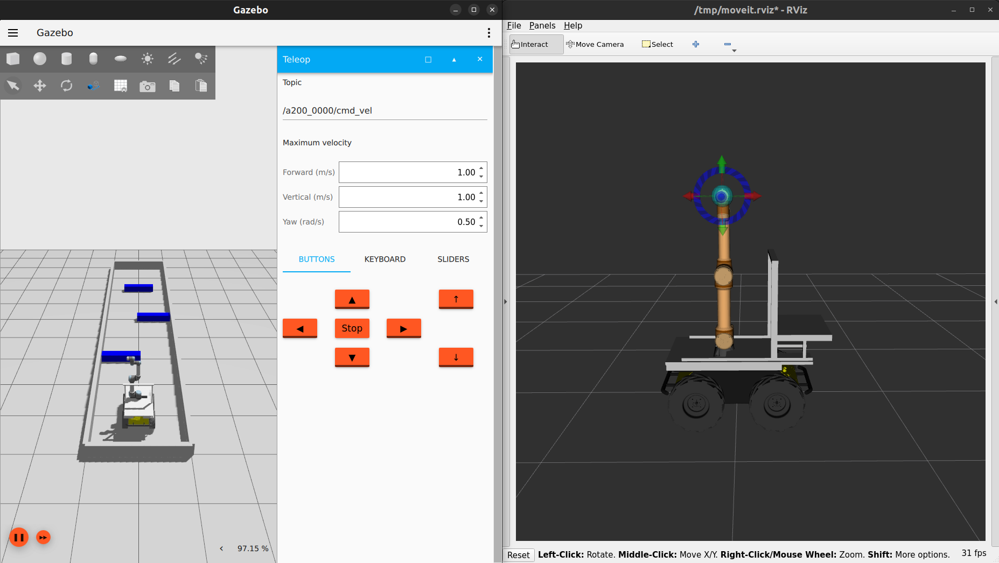

 Group Project Repository Submission Template 
## Index
  - [Overview](#overview) 
  - [Getting Started](#getting-started)
  - [Demo](#demo)
  - [Authors](#authors)
  - [References](#references)
  - [Credits](#credits)
<!--  Other options to write Readme
  - [Deployment](#deployment)
  - [Used or Referenced Projects](Used-or-Referenced-Projects)
-->
## MRAC0X(XX/XX): ClassName XX - Students
- Ainhoa Arnaiz
- Manuel Vicente
- Maria Luiza Gomes
- Leela Vasista Monavarthy

<!--Write a few sentences of academic context and project description -->  

The goal is to teleoperate both the Husky robot and the UR10e arm, enabling them to avoid obstacles on the floor and push those that are unavoidable. 

To achieve this, we designed a system that allows the user to control both robots using any available camera, incorporating hand tracking for intuitive command execution.
## Getting Started

### Prerequisites
Ensure that you fulfill the following criteria to replicate this project.
* Ubuntu LTS 20.04 <
* Python 3.7 <
* Docker

### Depencies
The project's dependencies include:
* Numpy - for matrix manipulation
* OpenCV - for image processing
* ROS - for interfacing with the robot

The dependencies are satisfied using the following sources:

```bash
# ROS Noetic and core dependencies
wget -c https://raw.githubusercontent.com/qboticslabs/ros_install_noetic/master/ros_install_noetic.sh && chmod +x ./ros_install_noetic.sh && ./ros_install_noetic.sh
# install numpy
pip3 install numpy setuptools
```

### Installing
A step by step series of examples that tell you how to get a development 
env running


7. Open VS Code and attach the container to VS Code

### Deployment

Go to folder and build image:
```bash
 .docker/build_image.sh
```
Run image
```bash
	.docker/run_user_nvidia.sh 
```
or if you have nvidia GPU use
```bash
.docker/run_user.sh
```

```bash 
sudo chown -R [YOUR USER NAME] /dev_ws
```

6. Run terminator
```bash
terminator
```


## Husky UR10e Simulation - Instructions

To change UR model go to: /dev_ws/src/clearpath_common/clearpath_manipulators_description/urdf/arm/universal_robots.urdf.xacro

Launch Simulation:

```
ros2 launch clearpath_gz simulation.launch.py setup_path:=/dev_ws/src/husky_commander/config/husky_ur
```

Don't forget to change cmd_vel to */a200_0000/cmd_vel*

Launch Moveit:

```
ros2 launch clearpath_manipulators moveit.launch.py setup_path:=/dev_ws/src/husky_commander/config/husky_ur use_sim_time:=true
```

Launch Rviz:
```
ros2 launch clearpath_viz view_moveit.launch.py namespace:=a200_0000 use_sim_time:=True
```



Launch hand teleop:
```
ros2 launch husky_commander husky_hand_teleop_sim.launch.py
```


Launch:
```
ros2 launch ur_commander iaac_ur10e.launch.py sim:=true
```

```
ros2 run tf2_ros static_transform_publisher 0 0 0 0 0 0 1 ur_base_link world
```

```
ros2 launch clearpath_viz  view_model.launch.py setup_path:=/dev_ws/src/husky_commander/config/husky_basic/
```

# Connect to husky
Split terminal
connect to husky wifi
```bash
ssh iaac@10.42.0.1
tmux new -s husky
```

```bash
crtl + b then %
```
terminal 1:
```bash
ros2 launch /etc/clearpath/platform/launch/platform-service.launch.py
```
TERMINAL 2:
```bash
ros2 launch husky_commander husky_hand_teleop_sim.launch.py
```